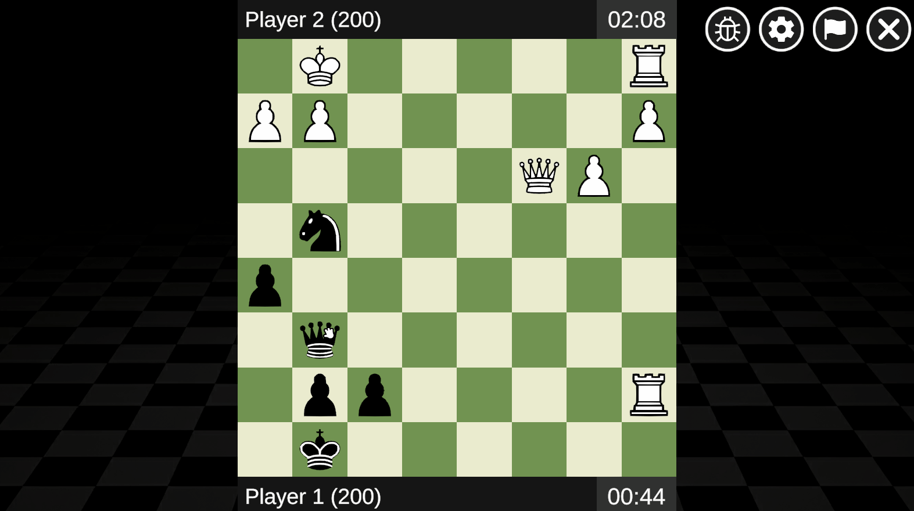
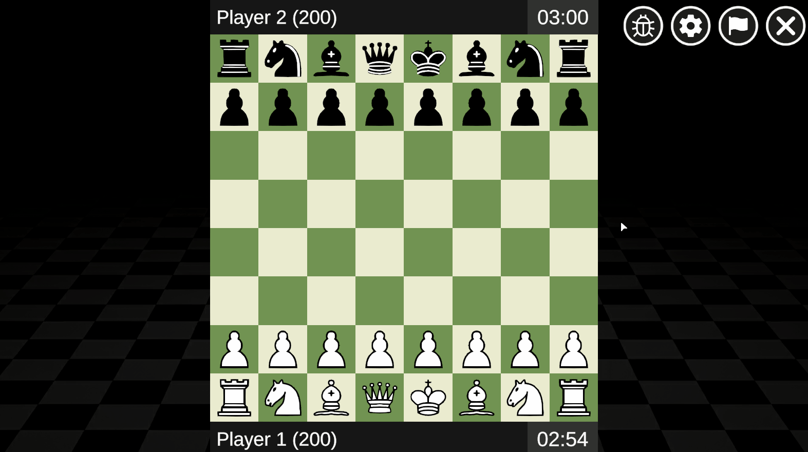

# 2D Chess
2D chess project made with Unity to practice game mechanics like chess rules, board state management, and online multiplayer.

  
  

## 🔎 Features

* Chess rules and legal move validation
* Online multiplayer with Photon PUN 2
* Board state synchronization
* Dynamic UI
* Game timers
* Debug tools

---

🌐 Browser version: https://mateo1q.itch.io/2d-chess

💾 Downloadable version: https://github.com/MateoJ4080/2d-chess/releases
